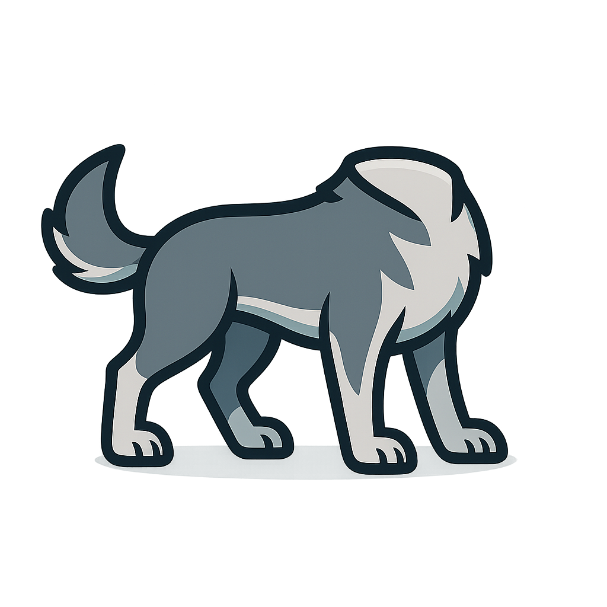

# Distroless glibc Base Image

<div align="center">
  
</div>

This repository builds, updates, and secures a multi-arch (currently only `x86_64` and `arm64`) **distroless `glibc` Docker base image**. The image is published to GitHub Container Registry (GHCR) at `ghcr.io/taihen/base-image`.

Images are available with both the `latest` tag and version tags (e.g., `v2024.01.15`) for reproducible builds.

This project has been configured to use the Chainguard `apko` toolchain, which is the best-in-class method for building minimal, secure, and reproducible container images.

Curious about distroless, checkout my [blog post](https://taihen.org/posts/distroless/).

## Why You Need a Secure and Simple Base Image

Modern containerized applications face increasing security threats and compliance requirements. Traditional base images often include unnecessary packages, tools, and potential vulnerabilities that expand your attack surface. A secure and simple base image is essential because:

- **Reduced Attack Surface**: By including only the bare minimum required to run your application (glibc and ca-certificates), there are fewer components that could contain vulnerabilities
- **Compliance**: Many security standards and regulations require minimizing unnecessary software in production environments
- **Smaller Images**: Minimal images mean faster pulls, reduced storage costs, and quicker deployments
- **No Shell or Package Manager**: Without these tools, attackers have fewer options if they manage to breach your container
- **Immutable Infrastructure**: Distroless images encourage building immutable containers where everything is defined at build time
- **Supply Chain Security**: Using a well-maintained base image with automated security updates helps protect against supply chain attacks

## Build Process

Instead of a `Dockerfile`, this project uses a declarative [`apko.yaml`](./apko.yaml) file to define the image contents. This file specifies:

- The minimal set of packages required from the [Wolfi](https://github.com/wolfi-dev) repository (`glibc`, `ca-certificates-bundle`, etc.).
- A non-root user (`65532:65532`) for secure execution.
- The target architectures (`linux/amd64`, `linux/arm64`).

This declarative approach, inspired by Google Distroless and perfected by Chainguard, ensures the resulting image contains only what is explicitly defined, drastically reducing the attack surface.

## Features

- **Declarative & Reproducible:** The `apko.yaml` file provides a clear, auditable, and reproducible definition of the image.
- **Multi-Arch:** Natively builds and pushes a multi-arch manifest for `linux/amd64` and `linux/arm64`.
- **Minimal & Secure:**
  - Built from trusted, minimal [Wolfi](https://github.com/wolfi-dev) packages.
  - Contains no shell, package manager, or other unnecessary components.
  - Runs as a non-root user (`65532:65532`).
  - Automatically rebuilt daily to incorporate the latest security patches from upstream packages.
  - Images are signed with Cosign using keyless signing.
  - A high-quality SBOM (Software Bill of Materials) is generated natively by `apko` during the build.
- **CI/CD:** A streamlined GitHub Actions workflow using [`wolfi-act`](https://github.com/wolfi-dev/wolfi-act) handles the entire build, publish, and sign process in a single, efficient step.

## Debug Image

While the main distroless image is designed for production use without a shell or debugging tools, sometimes you need these capabilities during development or troubleshooting. For this purpose, we provide a debug variant of the base image.

### Debug Image Configuration

The debug image is defined in [`debug.yaml`](./debug.yaml) and extends the base configuration with:

- **`wolfi-base` package**: Adds busybox (providing common Unix utilities) and apk-tools (package manager)
- **Root user**: Runs as root instead of the non-root user (65532:65532)
- **Shell entrypoint**: Sets `/bin/sh -l` as the default entrypoint

### When to Use the Debug Image

⚠️ **Warning**: The debug image should **NEVER** be used in production as it significantly increases the attack surface by including a shell and running as root.

Use cases for the debug image:

- Local development and testing
- Debugging application issues in non-production environments
- Exploring the container filesystem
- Installing additional packages for testing
- Troubleshooting permission or dependency issues

### Available Image Tags

**Main Production Image:**

- `ghcr.io/taihen/base-image:latest` - Latest production build
- `ghcr.io/taihen/base-image:v2024.01.15` - Specific version tag

**Debug Development Image:**

- `ghcr.io/taihen/base-image:debug` - Latest debug build
- `ghcr.io/taihen/base-image:v2024.01.15-debug` - Specific version debug tag

### Building the Debug Image Locally

To build the debug image using apko:

```sh
# Build for a single architecture
docker run -v $PWD:/work cgr.dev/chainguard/apko build debug.yaml debug:test debug.tar

# Load into Docker
docker load < debug.tar

# Run the debug image
docker run -it --rm debug:test
```

## What is apko and Wolfi?

### apko

[apko](https://github.com/chainguard-dev/apko) is a declarative tool for building container images using Alpine APK packages. Unlike traditional Dockerfiles that use imperative commands, apko uses a YAML configuration to define exactly what goes into an image. This approach:

- Produces minimal, reproducible images
- Generates SBOMs (Software Bill of Materials) automatically
- Eliminates unnecessary build artifacts and package managers
- Creates truly distroless images without shells or other debugging tools

### Wolfi

[Wolfi](https://github.com/wolfi-dev) is a Linux distribution designed specifically for containers, created by Chainguard. Key features:

- **glibc-based**: Unlike Alpine (which uses musl), Wolfi uses glibc for better compatibility
- **Security-focused**: Rapid CVE patching and minimal attack surface
- **Supply chain hardened**: All packages are signed and built with provenance
- **Container-native**: Designed from the ground up for containerized workloads
- **Daily updates**: Packages are rebuilt frequently to incorporate the latest security patches

Together, apko and Wolfi provide a secure foundation for building container images that meet range of requirements while maintaining minimal size and attack surface.

## How to Use

You can use this image as a secure and minimal base for your applications. You can use either the `latest` tag for the most recent version or a specific version tag (e.g., `v2024.01.15`) for reproducible builds.

### Example: Go (CGO-enabled)

```dockerfile
FROM golang:1.23 AS builder
WORKDIR /src
COPY main.go .
ARG TARGETARCH
ENV CGO_ENABLED=1 GOOS=linux GOARCH=$TARGETARCH
RUN go build -o /hello main.go

# Use latest tag
FROM ghcr.io/taihen/base-image:latest
# OR use a specific version for reproducible builds
# FROM ghcr.io/taihen/base-image:v2024.01.15
COPY --from=builder /hello /hello
USER 65532:65532
ENTRYPOINT ["/hello"]
```

### Example: Java (custom JRE with jlink)

```dockerfile
FROM eclipse-temurin:17-jdk AS builder
WORKDIR /app
COPY Hello.java .
RUN javac Hello.java
RUN echo "Main-Class: Hello" > manifest.txt && jar cfm hello.jar manifest.txt Hello.class
RUN $JAVA_HOME/bin/jlink --add-modules java.base --strip-debug --no-man-pages --no-header-files --compress=2 --output /jre

FROM ghcr.io/taihen/base-image:latest
COPY --from=builder /jre /jre
COPY --from=builder /app/hello.jar /app/hello.jar
ENTRYPOINT ["/jre/bin/java", "-jar", "/app/hello.jar"]
```

### Using the Debug Image for Development

```dockerfile
# For development and debugging
FROM ghcr.io/taihen/base-image:debug

# You can install additional packages with apk
RUN apk add --no-cache curl jq

# Debug your application interactively
COPY my-app /usr/local/bin/
ENTRYPOINT ["/bin/sh"]  # or ["/usr/local/bin/my-app"]
```

**Quick debugging session:**

```bash
# Run the debug image interactively
docker run -it --rm ghcr.io/taihen/base-image:debug

# Inside the container, you have shell access and tools
/ # apk add --no-cache curl
/ # curl -s https://httpbin.org/json | jq
/ # ps aux
/ # ls -la /
```

## Local Testing

To build the image locally, you need Docker with BuildKit enabled.

1. **Enable BuildKit:**

    ```sh
    export DOCKER_BUILDKIT=1
    ```

2. **Build for multiple platforms:**

    ```sh
    docker buildx create --use
    docker buildx build --platform linux/amd64,linux/arm64 -t ghcr.io/taihen/base-image:latest --push .
    ```

3. **Run the test suite:**

    ```sh
    # Test the latest published image
    ./test/test-image.sh

    # Test a specific image
    ./test/test-image.sh ghcr.io/taihen/base-image:latest
    ```

    The test script will:
    - Build and run a Go hello world application using the base image
    - Verify the non-root user configuration
    - Run a security scan with Trivy
    - Report any issues found

## Automation

The [`.github/workflows/build.yml`](./.github/workflows/build.yml) workflow handles the entire build, push, and sign process for both production and debug images. It is triggered on:

- A `push` to the `main` branch.
- A daily schedule (`cron: "0 5 * * *"`) to ensure images are kept up-to-date with upstream packages.

The workflow builds both image variants in parallel and applies the following tagging strategy:

- **Production images**: Tagged with `latest` and version tags (e.g., `v2024.01.15`)
- **Debug images**: Tagged with `debug` and version-debug tags (e.g., `v2024.01.15-debug`)

## Automatic Release System

This repository includes an intelligent automatic release system that creates GitHub releases only when there are actual changes in the built image. This prevents unnecessary releases when the daily cron job runs but no packages have been updated.

### How it Works

1. **Digest Comparison**: After each build, the workflow captures the image digest (a unique identifier based on the image's content).
2. **Change Detection**: The digest is compared with the previous build's digest stored as a GitHub artifact.
3. **Conditional Release**: A new GitHub release is created only if:
   - No previous digest exists (first run)
   - The current digest differs from the previous one (indicating changes)
4. **Release Contents**: Each release includes:
   - The image digest for verification
   - The SBOM (Software Bill of Materials) as an attachment
   - Instructions for verifying the image signature

### Benefits

- **Meaningful Releases**: Only creates releases when there are actual changes
- **Audit Trail**: Each release documents what changed and when
- **Resource Efficiency**: Avoids cluttering the releases page with identical builds
- **Supply Chain Security**: Every release includes verification instructions and SBOM

### Release Naming

Releases are automatically tagged with a date-based version format: `vYYYY.MM.DD` (e.g., `v2024.01.15`). If multiple releases occur on the same day, a counter is appended (e.g., `v2024.01.15.1`).

Each release creates:

- A GitHub release with the version tag
- A Docker image tagged with the same version (e.g., `ghcr.io/taihen/base-image:v2024.01.15`)
- The `latest` tag is also updated to point to the newest release

## Automated Testing

Before creating a release, the workflow runs comprehensive tests to ensure both the production and debug images work correctly:

### Test Suite

1. **Go Application Test**: Builds and runs a hello world Go application on both image variants
   - Verifies CGO compatibility (glibc linkage)
   - Tests both `linux/amd64` and `linux/arm64` architectures
   - Confirms correct user execution (UID 65532 for production, UID 0 for debug)
   - Validates environment variable handling

2. **Multi-Platform Build Test**: Ensures both images work correctly in multi-architecture builds

3. **Security Scan**: Runs Trivy to scan both image variants for vulnerabilities and reports any critical or high-severity issues

### Test Failure Handling

If any test fails:

- The workflow stops immediately
- No release is created
- The build artifacts remain available for debugging
- The next scheduled run will retry if the issues are resolved

This ensures that only fully functional and tested images are released.
